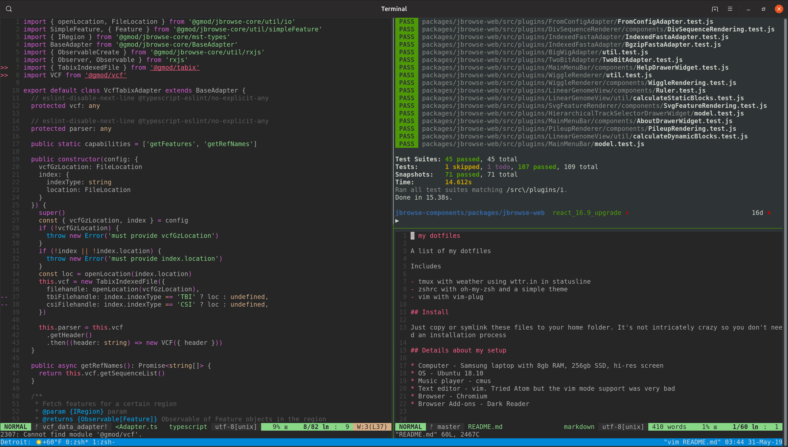

# my dotfiles

A list of my dotfiles

Includes

- tmux with weather using wttr.in in statusline
- zshrc with oh-my-zsh and a simple theme
- vim with vim-plug

## Install

Just copy or symlink these files to your home folder. It's not intricately crazy so you don't need an installation process

## Details about my setup

* Computer - Samsung laptop with 8gb RAM, 256gb SSD, hi-res screen
* OS - Ubuntu 19.04
* Music player - cmus
* Text editor - vim
* Browser - Chromium
* Browser Add-ons - Dark Reader

I have a preferred setup illustrated by the screenshot where my tmux screen is split into about 3 areas. This screen layout evolved slowly for me but now I quite like it. I previously closed/reopened vim frequently, or used multiple tmux windows, but now I like screen splitting. The left area is for code, which can be split to browser two or more files. The right area has a top and bottom for running test outputs, and a terminal, occaisionally code editing

The tmux setup evolved in parallel with my vim setup. I started with NERDTree but got rid of it, and instead I became very comfortable with fzf.vim and crucially, added some hotkeys to power it

* Ctrl+F to search the entire project for a string with ripgrep
* Ctrl+G to search the entire project for a filename
* Ctrl+H to open up most recently used files

These things enabled me to become much less reliant on a file browser inside vim

## Screenshot

## Random other notes

### C*mus setup

#### Recently added playlist

I have a "Recently added" playlist in cmus generated by a crontab

    * * * * * find ~/Music -type f -exec stat --printf "\%Z\t\%n\n" {} +|sort -rn|tail -n 5000|cut -f2|grep -v jpg|grep -v jpeg > ~/.config/cmus/recently_added.pl

Note the usage of stat with %Z which is "time of last status change", which helps with files unpacked from zip files and is different from standard measures of file time such as "created, last access, and last modification"

#### Recently played playlist

I also use set_status_display_program to append the currently playing track to text file, creating a "recently played playlist", see [cmus_recently_played.sh](https://github.com/cmdcolin/dotfiles/blob/master/cmus_recently_played.sh)

#### Playlist browser

I navigate to the folder containing these recently added and recently played text files using the cmus file browser (press 5)

### Wishlist

* Node debugging that didn't involve manually running `node --inspect-brk node_modules/.bin/jest` and then manually opening chrome://inspect
* File watcher for cmus

## Past iterations

- Tried Atom but the vim mode support was very bad
