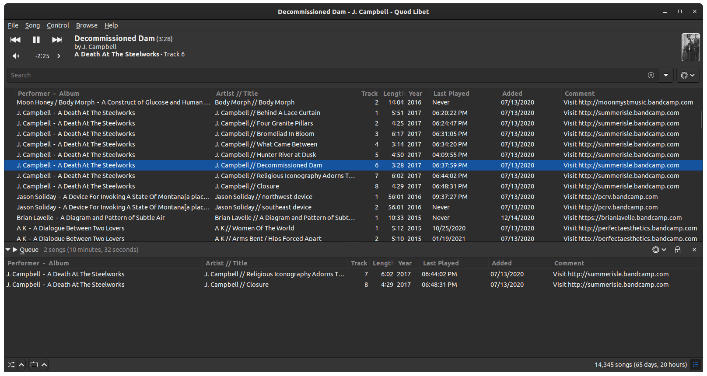

# my dotfiles

A list of my dotfiles

Includes

- tmux with weather using wttr.in in statusline
- zsh
- neovim with vim-plug, coc.nvim

If you take nothing else from this, try the weather statusline in .tmux.conf!
It's fun :)

Favorite vim keybindings:

* ww - save in vim (instead of :w)
* qq - quit vim (instead of :q)
* ctrl+g - file name search (fzf+git ls-files)
* ctrl+f - file content search (fzf+git grep)

These are silly but reduce keypresses and complex key presses substantially

## Install

Just copy or symlink these files to your home folder. It's not intricately
crazy so you don't need an installation process

## Details about my setup

- Computer - Dell laptop with 32gb RAM, 512GB SSD
- OS - Ubuntu 20
- Music player - quod libet
- Text editor - neovim+coc.nvim+treesitter+fzf
- Browser - Chromium
- Browser Add-ons - Dark Reader

I perform a lot of work in tmux+neovim where I split the screen vertically (two
halves side by side) with tmux and then do either tests on one side of the
screen or have two split screens. If needed I make a new tmux tab. I close and
re-open vim a lot which is kind of crazy in a way, but seems to work for me

Using fzf for quick file name searches or greps enabled me to become much less
reliant on a file browser like NERDTree, so I don't use any NERDTree type
sidebar

## Screenshot


## Random other notes

### Music player setup

My main customization goals of pretty much any music player are to have

- A list of albums in the form `Artist - Album name` (as opposed to an itunes
  style layout where it is a list of artists and then a separate list of
  albums)
- A recently added playlist
- A recently played playlist

These goals are hangovers from using foobar2000 but I try to have a similar
setup on linux now, and currently use Quod Libet. It is not as customizable as
foobar2000 but it gets most of the way there



To get the list in the format `Artist - Album name`, and to add some support so
that "Various artists" compilations get merged into a single item in this list,
I use this config in quodlibet's paned browser

```
    <performer|<performer>|<albumartist|<albumartist>|<artist>>>  -  <album>
```

Then I also turn on "Last played" and "Added" columns in the playlist browser
to sort by last played and recently added

## Old stuff

[OLD.md](./OLD.md)
