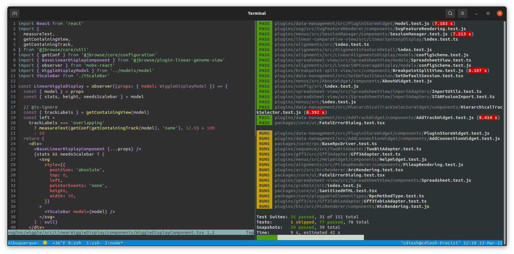

# my dotfiles

A list of my dotfiles

Includes

- tmux with weather using wttr.in in statusline
- zsh
- neovim with lua init script (based on kickstart.nvim)

If you take nothing else from this, try the weather statusline in .tmux.conf!
It's fun :)

Favorite vim keybindings:

- `<leader>gg` - file name search (telescope find-files)
- `<leader>ff` - file content search (telescope live-grep)

leader for me is comma (,)

I have gotten repetitive strain injury from excessive keyboard shortcuts that
use the control key (left control, left pinky gets twinged, sometimes called
emacs pinky though I don't use emacs). I have to be careful with contorting
hand, but also I found out that you have to be careful with using e.g. armrests
too https://cmdcolin.github.io/posts/2022-07-08-pinky

## Install

For nvim, cp init.lua to ~/.config/nvim/init.lua and copy the lua directory to
~/.config/nvim/lua

For other stuff e.g. zsh, cp the .zshrc to ~/.zshrc and so on

## Details about my setup

- Computer - Dell laptop with 32gb RAM, 512GB SSD
- OS - Ubuntu 23.04
- Music player - [fml9000](https://github.com/cmdcolin/fml9000) or
  [ytshuffle](https://cmdcolin.github.io/ytshuffle/)
- Text editor - neovim nightly 0.10 + built-in lsp + treesitter + fzf
- Browser - Firefox (switched from Chrome Oct 2022)
- Browser Add-ons - Dark Reader, uBlock origin

I perform a lot of work in tmux+neovim where I split the screen vertically (two
halves side by side) with tmux and then do either tests on one side of the
screen or have two split screens. If needed I make a new tmux tab. I close and
re-open vim a lot which is kind of crazy in a way, but seems to work for me

Using fzf for quick file name searches or greps enabled me to become much less
reliant on a file browser like NERDTree, so I don't use any NERDTree type
sidebar

## Screenshot

## Random other notes

### Music player setup

I started creating my own music player to try to bring my foobar2000 to native
linux with gtk4-rs

Progress is slow on it but it does play MP3s :)
https://github.com/cmdcolin/fml9000

I also made an app, ytshuffle, to load entire channels worth of youtubes and
browse like a music library. See https://cmdcolin.github.io/ytshuffle/

## Old stuff

[Older setup stuff](./OLD)

## References

https://github.com/manzt/dotfiles
